# BeyondInfra CRM — Project Lifecycle

How a project moves from a new listing or requirement through client intake, matching (or developer
outreach), to a closed deal.

```mermaid
flowchart TD
    A[New project created] --> B{What kind of project?}

    B -->|Residential, Commercial,<br/>or Industrial| C{Listing or requirement?}
    B -->|Land| C
    B -->|Special Projects:<br/>Joint Venture / Redevelopment| D[Fill land, JV/Redevelopment<br/>details, documents, photos]

    C -->|Listing<br/>Sell / Rent / Sale| E1[Fill property details:<br/>location, documents, photos]
    C -->|Requirement<br/>Buy / Tenant| E2[Fill requirement details:<br/>budget, preferred areas]

    E1 --> F[Generate client link]
    E2 --> F
    D --> F

    F --> G[Client opens the link]
    G --> H[Client enters phone number]
    H --> I{Does phone match<br/>the record on file?}
    I -->|No| H
    I -->|Yes| J[OTP verification]
    J --> K[Client fills in the form,<br/>step by step]
    K --> L[Every answer is<br/>saved automatically]
    L --> M{Is the project<br/>still open?}
    M -->|No| N[Locked — read only,<br/>no further changes]
    M -->|Yes| O[Answers saved]

    O --> P[Desk fills internal-only fields:<br/>brokerage, financials, scoring]

    P --> Q{Which path next?}
    Q -->|Residential / Commercial /<br/>Industrial / Land| R[Matching: pair listings<br/>against requirements]
    Q -->|Special Projects| S[Developer outreach:<br/>share with developers]

    R --> R1[A match is found]
    R1 --> R2[Team opens the Award step]

    S --> S1[Developers respond<br/>with proposals]
    S1 --> S2[Best proposal selected]
    S2 --> S3[Team opens the Award step]

    R2 --> T{Already has<br/>a deal on record?}
    S3 --> T
    T -->|Yes| U[Blocked — one deal per<br/>project, no exceptions]
    T -->|No| V[Deal terms entered:<br/>type, price/rent, closing date]

    V --> W[Deal recorded]
    W --> X[Project marked Completed]
    X --> Y{Was this a<br/>matched pair?}
    Y -->|Yes| Z[Counterpart project also<br/>marked Completed]
    Y -->|No| AA[Developer status<br/>marked Selected]

    Z --> AB[Project shows<br/>Awarded, with deal details]
    AA --> AB

    style A fill:#eff6ff,stroke:#2563eb
    style V fill:#fef9c3,stroke:#ca8a04
    style W fill:#dcfce7,stroke:#16a34a
    style AB fill:#dcfce7,stroke:#16a34a
    style U fill:#fee2e2,stroke:#dc2626
    style N fill:#fee2e2,stroke:#dc2626
```

---

## How to read it

- **Rectangles** are steps in the process.
- **Diamonds** are decision points — the process branches depending on the answer.
- **Green** marks where a deal is actually struck and recorded.
- **Red** marks a stop: either the client needs to re-enter their phone, the project is locked
  from further edits, or the system is blocking a duplicate deal.

## Two ways a deal gets made

| | Path A — Matching | Path B — Developer outreach |
|---|---|---|
| Used for | Residential, Commercial, Industrial, Land | Special Projects (Joint Venture, Redevelopment) |
| How it works | A listing (something for sale/rent) is paired against a requirement (something someone wants) | The project is shared with developers, who respond with proposals |
| What gets picked | A matching pair | The strongest proposal |

## Glossary

| Term | Plain-language meaning |
|---|---|
| Listing project | A property someone has to offer — for sale or rent |
| Requirement project | What someone is looking to buy or rent |
| Match | A listing and a requirement that have been paired up as a fit |
| Developer proposal | An offer submitted by a developer for a Joint Venture or Redevelopment project |
| Deal type | How the deal closed — sold, rented, leased, redevelopment confirmed, withdrawn, or requirement closed |
| Completed | The project's final state once a deal has been recorded against it |

---

*BeyondInfra CRM — Project Lifecycle Reference*
