# BeyondInfra CRM — End-to-End Test Cases

Scope: every Category × Subcategory combination, from project creation through client data
capture, matching, and award (deal closure). Written against the current schema/API:

- Categories: **Residential, Commercial, Industrial, Land, Special Projects**
- Subcategories per category: **Buy, Sell, Rent, Tenant** (Residential/Commercial/Industrial);
  **Buy, Sale** (Land); **Joint Venture, Redevelopment** (Special Projects)
- Award path A (Match-based): applies to Buy/Sell/Rent/Tenant/Land — a **Sell/Rent-side listing
  project** is matched against a **Buy/Rent/Tenant-side demand project**, then awarded via
  `POST /api/projects/:id/award` with `matchId` + `dealType`.
- Award path B (Developer-proposal-based): applies to **Redevelopment/Joint Venture** — a
  `DeveloperProposal` is marked `SELECTED`, then awarded via the same endpoint with
  `developerProposalId` + `dealType`.

Each test case follows the same generic skeleton:
1. Create project (category/subcategory/template) → internal record exists in `OPEN` state.
2. Generate & share client link → client completes OTP-gated intake form.
3. Verify captured responses against the template's required fields.
4. Run matching (or developer outreach, for Special Projects) → confirm a candidate match/proposal.
5. Award → `Deal` created, project status flips to **Completed**, counterpart project (if any)
   also flips to Completed.

---

## Lifecycle Flowchart

```mermaid
flowchart TD
    A[New Project] --> B{Category / Subcategory}

    B --> B1[Residential / Commercial / Industrial]
    B --> B2[Land]
    B --> B3[Special Projects]

    B1 --> C1{Side}
    C1 -->|Sell or Rent<br/>listing-side| D1[Fill property, location,<br/>documents, photos]
    C1 -->|Buy or Tenant<br/>demand-side| D2[Fill requirements,<br/>budget, preferred areas]

    B2 --> C2{Side}
    C2 -->|Sale<br/>listing-side| D1
    C2 -->|Buy<br/>demand-side| D2

    B3 --> D3[Fill land details,<br/>JV / Redevelopment details,<br/>documents, photos]

    D1 --> E[Generate Client Link]
    D2 --> E
    D3 --> E

    E --> F[Client opens /p/:token]
    F --> G[Enter phone]
    G --> H{Phone matches<br/>ClientLink.phone?}
    H -->|No| G
    H -->|Yes| I[OTP sent / dev-bypass]
    I --> J[Client fills wizard<br/>step by step]
    J --> K[Autosave per field]
    K --> L{Project state<br/>== OPEN?}
    L -->|No| M[Read-only banner,<br/>fields disabled]
    L -->|Yes| N[Responses saved]

    N --> O[Internal: fill isInternal fields<br/>Brokerage %, Financial Breakup,<br/>Potential Scoring]

    O --> P{Category path}
    P -->|Residential / Commercial /<br/>Industrial / Land| Q[Matching:<br/>Sell/Sale listing vs<br/>Buy/Rent/Tenant demand]
    P -->|Special Projects<br/>JV / Redevelopment| R[Developer outreach:<br/>send to developers]

    Q --> Q1[Match created<br/>matchPct, criteria]
    Q1 --> Q2[Open Award Modal<br/>select matchId]

    R --> R1[DeveloperProposal<br/>NOT_CONTACTED to<br/>PROPOSAL_RECEIVED]
    R1 --> R2[Mark proposal SELECTED]
    R2 --> R3[Award using<br/>developerProposalId]

    Q2 --> S{Existing Deal<br/>on project?}
    R3 --> S
    S -->|Yes| T[409 Conflict:<br/>already has a deal]
    S -->|No| U[POST /api/projects/:id/award<br/>dealType + price/rent + closureDate]

    U --> V[Deal created<br/>dealNumber assigned]
    V --> W[Project status set to<br/>Completed]
    W --> X{Matched pair?}
    X -->|Yes| Y[Counterpart project<br/>also set to Completed]
    X -->|No| Z[Developer proposal<br/>status = SELECTED]

    Y --> AA[Project page shows<br/>Awarded banner + Deal info]
    Z --> AA

    style A fill:#eff6ff,stroke:#2563eb
    style U fill:#fef9c3,stroke:#ca8a04
    style V fill:#dcfce7,stroke:#16a34a
    style AA fill:#dcfce7,stroke:#16a34a
    style T fill:#fee2e2,stroke:#dc2626
    style M fill:#fee2e2,stroke:#dc2626
```

---

## Legend

| Term | Meaning |
|---|---|
| Listing project | Sell/Rent-side project — someone has a property to offer |
| Demand project | Buy/Rent/Tenant-side project — someone wants a property |
| Deal Type | One of `SOLD`, `RENTED`, `LEASED`, `REDEVELOPMENT_CONFIRMED`, `WITHDRAWN`, `REQUIREMENT_CLOSED` |
| OTP dev bypass | When `OTP_DEV_BYPASS` env var is set, that fixed code works instead of a random SMS OTP |

---

## 1. Residential

### 1.1 Residential — Buy (demand-side)

| Step | Action | Expected Result |
|---|---|---|
| 1 | Projects → New Project → Category: Residential, Subcategory: Buy | Project created with `Client Profile — Buyer`, `Property Requirements`, `Commercial Details`, `Potential Scoring` groups; state `OPEN` |
| 2 | Fill Primary Contact Name/Phone (required) | Save succeeds; Preferred Areas repeater accepts ≥1 area |
| 3 | Attempt to leave Property Type / Saleable Area / Budget Min / Budget Max blank and view project | Fields flagged incomplete (required-but-empty) in the UI's completion indicator |
| 4 | Fill Property Type (Apartment/Individual House/Villa), Saleable Area, Bedrooms, Budget Min/Max, Preferred Areas | Project marked fully filled |
| 5 | Set internal-only fields: Ownership Type, Financial Expectation Breakup, Brokerage %, Potential Scoring (Mandate/Commission/Timeline) | Fields save; not visible on any client-facing view |
| 6 | Go to Matching tab | Project appears as a demand-side candidate once a matching Residential Sell listing exists |

### 1.2 Residential — Sell (listing-side)

| Step | Action | Expected Result |
|---|---|---|
| 1 | New Project → Residential → Sell | Groups created: `Client Profile — Seller/Owner`, `Property Type`, `Property Details`, `Location`, `Documents — Built Property`, `Photos`, `Commercial Details`, `Potential Scoring` |
| 2 | Generate client link (Project detail → Share) | `ClientLink` created, URL copyable, `OTP_SENT` audit log optional until client uses it |
| 3 | As client: open `/p/:token`, enter phone matching `ClientLink.phone` | OTP step renders; dev-bypass code (if enabled) authenticates |
| 4 | Fill required fields: Primary Owner Name, Primary Contact Name/Phone, Property Type, Saleable Area, Street Name, Area/Locality, Price Expected Min/Max | Autosave pill cycles Saving → Saved; wizard step progress % increases |
| 5 | Fill **Current Land Status**, **New Guideline Value (TNREGINET)**, **Survey Number** (newly added fields) | Values persist under `res-sell-details` group, visible on internal project page |
| 6 | Upload at least one document (e.g. Patta) and one photo | `ProjectFile` records created, visible in internal Documents/Photos panel |
| 7 | Internal: set Brokerage %, Financial Demand Breakup, Number of Owners, Potential Scoring (Mandate/Commission/Timeline) | Internal-only fields save; excluded from client view |
| 8 | Matching tab → run/refresh matching against Residential Buy demand projects | `Match` rows appear with `matchPct`, `criteriaMatched`/`criteriaMissed` |
| 9 | Open Award modal on a match, select Deal Type `SOLD`, enter Final Price, Closure Date | `POST /api/projects/:id/award` succeeds → `Deal` created with `dealNumber` |
| 10 | Reload both listing and demand project | Both `status` = **Completed**; Match `confirmedAt` set; project shows "Awarded — DEAL-xxxx" banner |
| 11 | Attempt to award the same project again (different match) | Rejected 409 "This property already has a closed deal." |

### 1.3 Residential — Rent (listing-side)

| Step | Action | Expected Result |
|---|---|---|
| 1 | New Project → Residential → Rent | Same property/location/document/photo groups as Sell, plus `Rental Details`, `Potential Scoring` (rent-specific) |
| 2 | Client fills Nature of Deal (Giving/Asking), Rental Min/Max, Security Deposit, Period of Tenancy, Lock-in Period, Tenancy Type | Values save; conditional fields (if any) show/hide correctly |
| 3 | Fill Current Land Status / New Guideline Value / Survey Number (shared `res-sell-details` group) | Confirms same group is reused between Sell and Rent — values match regardless of which template loaded them |
| 4 | Internal: Commission Finalized scored as High if `>= one month rent`, Low if `< one month rent` | Potential Scoring reflects doc's rent-specific tier rule (manual entry, not auto-computed — verify UI allows selecting the correct option) |
| 5 | Matching against Residential Rent (Tenant-side) demand projects | Matches surface with tenancy-relevant criteria |
| 6 | Award with Deal Type `RENTED`, Final Rent value | Deal created; both projects → Completed |

### 1.4 Residential — Tenant (demand-side)

| Step | Action | Expected Result |
|---|---|---|
| 1 | New Project → Residential → Tenant | Groups: `Client Profile — Buyer`, `Tenant Requirements`, `Commercial Details`, `Potential Scoring` |
| 2 | Fill Property Subtype, Area Min/Max, Lease Duration, Lock-in, Move-in Date, Preferred Areas (repeater, required) | Required-field validation matches template flags (`*`) |
| 3 | Matching against Residential Rent listings | Candidate matches appear |
| 4 | Award (via the listing project's Award flow, Deal Type `RENTED` or `LEASED`) | Both Tenant demand project and Rent listing project → Completed |

---

## 2. Commercial

### 2.1 Commercial — Buy

| Step | Action | Expected Result |
|---|---|---|
| 1 | New Project → Commercial → Buy | Groups: `Client Profile — Buyer`, `Property Requirements` (Property Type: Retail Outlet/Office Space/Coworking, Area, Seats, Car Parks), `Commercial Details`, `Potential Scoring` |
| 2 | Fill required: Primary Contact Name/Phone, Property Type, Area Required, Budget Min/Max, Preferred Areas | Completion indicator reaches 100% for required fields |
| 3 | Matching against Commercial Sell listings | Matches surface |
| 4 | Award, Deal Type `SOLD` | Deal created; both projects Completed |

### 2.2 Commercial — Sell

| Step | Action | Expected Result |
|---|---|---|
| 1 | New Project → Commercial → Sell | Groups include `comm-sell-details` (now with Current Land Status / New Guideline Value / Survey Number appended), `Location`, `Documents — Built Property`, `Photos`, `Commercial Details`, `Potential Scoring`, plus **Development Details**, **Area/Availability**, **Tenant Profile** (extended commercial-specific groups) |
| 2 | Client fills Property Type, Saleable Area, Street Name/Area/Google Pin, Price Expected Min/Max | Required fields (`*`) enforce completion |
| 3 | Fill **Current Land Status**, **New Guideline Value (TNREGINET)**, **Survey Number** | Confirm fields persist in `comm-sell-details` (verifies this session's template fix) |
| 4 | Fill optional Development Details (Asset Class, Power Backup, Air Conditioning) and Area/Availability (Total Development Size, Floor Plate) | Internal admin fields save; used for PPT/marketing export |
| 5 | Upload Documents + Photos | Files attach correctly |
| 6 | Matching against Commercial Buy demand projects | Matches surface with `matchPct` |
| 7 | Award, Deal Type `SOLD`, Final Price | Deal created; Completed status on both sides |

### 2.3 Commercial — Rent

| Step | Action | Expected Result |
|---|---|---|
| 1 | New Project → Commercial → Rent | Same `comm-sell-details`/Location/Documents/Photos groups as Sell (shared), plus `Rental Details` (Nature of Deal, Rental Min/Max, Security Deposit, Quoted Rent/sq.ft, Rent Escalation) |
| 2 | Fill Nature of Deal = "Giving Property for Rent", Rental Min/Max | Required fields validate |
| 3 | Confirm Current Land Status / New Guideline Value / Survey Number visible (shared group with Sell) | Fields present without re-entry if same underlying `QuestionGroup` used across a re-created project — for a fresh project, fields must be re-enterable |
| 4 | Matching against Commercial Tenant demand projects | Matches surface |
| 5 | Award, Deal Type `LEASED` | Deal created; Completed on both sides |

### 2.4 Commercial — Tenant

| Step | Action | Expected Result |
|---|---|---|
| 1 | New Project → Commercial → Tenant | Groups: `Tenant Requirements` (Property Subtype: Office/Retail/Showroom/Co-working, Area Min/Max, Lease Duration, Facility Grade), `Commercial Details` (Rent/Deposit Budget), `Potential Scoring` |
| 2 | Fill required fields incl. Preferred Areas repeater | Validates |
| 3 | Matching against Commercial Rent listings | Matches surface |
| 4 | Award, Deal Type `LEASED` | Both projects Completed |

---

## 3. Industrial

### 3.1 Industrial — Buy

| Step | Action | Expected Result |
|---|---|---|
| 1 | New Project → Industrial → Buy | Groups: `Client Profile — Buyer`, `Property Requirements` (Property Type: Factory Shed/Warehouse/Business Space/Resort, Flooring Type, Type of Facility, Power Connection Level), `Commercial Details`, `Potential Scoring` |
| 2 | Fill required fields | Validates against template `*` flags |
| 3 | Matching against Industrial Sell listings | Matches surface |
| 4 | Award, Deal Type `SOLD` | Deal created |

### 3.2 Industrial — Sell

| Step | Action | Expected Result |
|---|---|---|
| 1 | New Project → Industrial → Sell | Groups: `ind-sell-details` (now includes Current Land Status / New Guideline Value / Survey Number), Location, Documents, Photos, Commercial Details, Potential Scoring |
| 2 | Fill Type of Facility (Grade A/Regular), Flooring Type, Power Connection Level, Passage Property fields, Corner Plot | Values save; passage sub-fields only relevant when Passage Property = Yes (verify conditional visibility if `conditionalJson` is set) |
| 3 | Fill Current Land Status / New Guideline Value / Survey Number | Confirms this session's Industrial fix |
| 4 | Documents + Photos upload | Files attach |
| 5 | Matching against Industrial Buy demand projects | Matches surface |
| 6 | Award, Deal Type `SOLD` | Deal created; both Completed |

### 3.3 Industrial — Rent

| Step | Action | Expected Result |
|---|---|---|
| 1 | New Project → Industrial → Rent | Shares `ind-sell-details`/Location/Documents/Photos with Sell; adds `Rental Details` |
| 2 | Fill Nature of Deal, Rental Min/Max, Security Deposit, Tenancy Type | Validates |
| 3 | Matching against Industrial Tenant demand projects | Matches surface |
| 4 | Award, Deal Type `RENTED` or `LEASED` | Deal created |

### 3.4 Industrial — Tenant

| Step | Action | Expected Result |
|---|---|---|
| 1 | New Project → Industrial → Tenant | Groups: `Tenant Requirements` (Property Subtype: Warehouse/Factory/Godown/Cold Storage), `Commercial Details`, `Potential Scoring` |
| 2 | Fill required fields incl. Preferred Areas | Validates |
| 3 | Matching against Industrial Rent listings | Matches surface |
| 4 | Award | Deal created; both Completed |

---

## 4. Land

### 4.1 Land — Buy

| Step | Action | Expected Result |
|---|---|---|
| 1 | New Project → Land → Buy | Groups: `Client Profile — Buyer`, `Land Related Details` (Segment: Residential/Commercial/Industrial, Purpose of Buying Land multiselect, Land Size Min/Max with auto-calc Grounds/Acres/Cents), `Commercial Details`, `Potential Scoring` |
| 2 | Enter Land Size Min in sqft only | Grounds/Acres/Cents auto-calc fields populate automatically (per `autoCalcJson`) |
| 3 | Select Segment = Residential → verify Purpose of Buying Land options filter to House/Apartment Development/Plotting only (per doc's sub-segment-dependent list) | **Gap check**: confirm UI actually filters options by Segment, or shows the full flat option list regardless — flag if not filtered, since template stores one flat `MULTISELECT` list rather than a segment-conditional one |
| 4 | Fill Road Width Expected, Frontage, Budget Min/Max | Required fields validate |
| 5 | Internal: Land Price vs Budget scoring (`High` if price < budget, else `Low`) | Verify manual selection matches doc's auto-comparison intent — currently a manual RADIO, not auto-computed |
| 6 | Matching against Land Sale listings | Matches surface |
| 7 | Award, Deal Type `SOLD` | Deal created |

### 4.2 Land — Sale

| Step | Action | Expected Result |
|---|---|---|
| 1 | New Project → Land → Sale | Groups: `Client Profile — Seller/Owner`, `Location`, `Land Details` (Land Area × 3 measurement types, Dimensions, Frontage, Road Width, Survey Number, New Guideline Value, **Current Land Classification**, **Approval Authority**, **Current Land Status**, Passage/Corner Plot), `Documents — Land`, `Photos`, `Commercial Details` (Segment, Price Min/Max), `Potential Scoring` |
| 2 | Fill Land Area as per Sale Deed/Patta/Survey Drawing, Road Width (required), Segment (required), Price Min/Max (required) | Validates |
| 3 | Fill Survey Number, New Guideline Value, Current Land Status, Current Land Classification, Approval Authority | All present pre-existing — confirms Land template already had the fields other categories were missing |
| 4 | Upload Topo Survey Drawing, Patta, EC, Sale Deed | Files attach under `documents-land` |
| 5 | Internal: Road Width Rating (Low <30ft / Medium 30-39ft / High 40-59ft / Very High 60ft+), HRB Potential (High/Medium/Low) | Manually selected per doc's tier thresholds — verify against Road Width value entered in step 2 for consistency |
| 6 | Matching against Land Buy demand projects (matched by Segment) | Matches surface |
| 7 | Award, Deal Type `SOLD` | Deal created; both projects Completed |

---

## 5. Special Projects

### 5.1 Joint Venture

| Step | Action | Expected Result |
|---|---|---|
| 1 | New Project → Special Projects → Joint Venture | Groups: `Client Profile — Seller/Owner`, `Location`, `Land Details` (same shared group as Land Sale/Redevelopment), `Joint Venture Details` (Residential/Commercial toggle, Association fields, Owner Exit Preference, Flat/Facility Demands), `Documents — Land`, `Photos`, `Potential Scoring` |
| 2 | Fill Residential or Commercial (required), Street Name/Area (required), Road Width (required) | Validates |
| 3 | Fill Association Name, Is Association Registered, Accounts Filed Regularly, Reasons for JV | Saves under `jv-details` |
| 4 | Fill Owner Exit Preference = "Exit", If Exit — How Many Months | Conditional field (if wired) shows only when Exit selected — verify |
| 5 | Fill Flat/Facility Demands (multiselect) + Other Facility Demands free text | Saves |
| 6 | Upload Documents — Land (Topo Survey, Patta, EC, Sale Deed) | Files attach |
| 7 | Internal: Road Width Rating, HRB Potential (same tiers as Land Sale) | Manual RADIO selection |
| 8 | **Developer outreach** (not Match-based): go to Developers section, send this project to one or more developers | `DeveloperProposal` rows created with status progressing `NOT_CONTACTED → PROJECT_SENT → ... → PROPOSAL_RECEIVED` |
| 9 | Shortlist and move a proposal to `SELECTED` (either directly or via Award flow) | Only one proposal per project can be `SELECTED` at a time — verify attempting to select a second one while another is already `SELECTED` is rejected (409, per award route's `otherSelected` check applies at award time) |
| 10 | Award using `developerProposalId`, Deal Type `REDEVELOPMENT_CONFIRMED` | Deal created; project status → Completed; `DeveloperProposal.status` → `SELECTED` |
| 11 | Attempt second award on same project | Rejected 409 "This property already has a closed deal." |

### 5.2 Redevelopment

| Step | Action | Expected Result |
|---|---|---|
| 1 | New Project → Special Projects → Redevelopment | Groups: `Client Profile — Seller/Owner`, `Location`, `Land Details` (shared), `Redevelopment Details` (Apartment Name required, Association fields, Number of Housing Units, Number of Blocks dropdown 0–10, Flat Details **REPEATER**, Redevelopment Consent %, Current Amenities), `Documents — Land`, `Photos`, `Potential Scoring` |
| 2 | Fill Apartment Name (required), Street Name/Area (required), Road Width (required) | Validates |
| 3 | Fill Number of Housing Units, Number of Blocks, Number of Floors Currently, Total Built-up Area | Saves under `redev-details` |
| 4 | Add multiple entries to **Flat Details (per unit)** repeater: owner name, contact, super built-up area, UDS, any loan on flat | Each repeater row persists independently; verify add/remove row works and data survives reload |
| 5 | Fill Redevelopment Consent % (e.g. 75) | Saves as NUMBER |
| 6 | Fill Current Amenities (multiselect: Parking/Lift/Club House/Generator/Other) | Saves |
| 7 | Fill Financial Demands from Owners, Flat/Facility Demands from Owners, Other Facility Demands | Saves |
| 8 | Upload Documents — Land incl. "Sale Deed of all flats individually" equivalent | Verify multiple files can be attached to a single FILE-type document field, or confirm current model only supports one file per field (per doc's open question: "Can we have more than one document uploaded in each field?") — **flag as known limitation if single-file-per-field** |
| 9 | Internal: Consent Rating (High 100% / Medium 68–99% / Low <68%) — cross-check against the % entered in step 5 | Verify correct tier is selectable/consistent (e.g. 75% → Medium) |
| 10 | Internal: Road Width Rating, Utilized FSI Rating (High/Low), HRB Potential | Manual RADIO entries — cross-check Utilized FSI Notes textarea for the underlying calculation (Total super built-up area / Land area) since there's no live auto-calc field wired for FSI itself |
| 11 | Developer outreach: send to developers, progress a `DeveloperProposal` to `SELECTED` | Same flow as JV 5.1 steps 8–9 |
| 12 | Award using `developerProposalId`, Deal Type `REDEVELOPMENT_CONFIRMED`, Final Price/notes | Deal created; project → Completed |
| 13 | Verify project detail page shows "Awarded — DEAL-xxxx" with Winning Developer name | Matches the `isRedevelopment` branch in the award summary UI |

---

## 6. Cross-Cutting Test Cases

| # | Scenario | Expected Result |
|---|---|---|
| C1 | Client OTP: phone entered does not match `ClientLink.phone` | `POST /api/client/otp` returns 400 "Phone number does not match" |
| C2 | Client OTP: correct phone, `OTP_DEV_BYPASS` set | Fixed dev code accepted at `/api/client/verify-otp`; `bi_client_token` cookie set |
| C3 | Client submits data, project `state` changed to non-`OPEN` (e.g. `LOCKED`) mid-fill | Client portal shows read-only banner; fields render `disabled`, no further autosave writes accepted |
| C4 | Additional Fields (ad-hoc): add a TEXT custom field with value in one step | Single `POST /api/projects/:id/custom-fields` call creates field pre-filled — no separate edit step required (per this session's UI simplification) |
| C5 | Additional Fields: add an IMAGE custom field | File picker inline in Add form; Save both creates the field and uploads the file in one action |
| C6 | Additional Fields section placement | Renders after all template groups (including Potential Scoring), at the bottom of the project detail page (per this session's reordering) |
| C7 | Award attempted with both `matchId` and `developerProposalId` | 400 "Provide only one of matchId or developerProposalId" |
| C8 | Award attempted with neither | 400 "Either matchId or developerProposalId is required" |
| C9 | Award attempted without `dealType` | 400 "dealType is required" |
| C10 | Award attempted by a non-`SUPER_ADMIN`/`OWNER` role | 403 Forbidden |
| C11 | Award succeeds | Both the listing and demand project (if matched pair) get `status` = the Status row named "Completed"; if no such Status row exists in this environment, `statusId` is left unchanged — verify a "Completed" `Status` record exists before running award tests |
| C12 | Internal-only (`isInternal: true`) fields (Brokerage %, Financial Breakup, all Potential Scoring fields) | Never appear on the client-facing `/p/:token` wizard, only on the internal project detail page |
| C13 | Required (`isRequired: true`) fields left blank | Project's completion percentage/indicator reflects missing required fields; does not block saving individual responses (autosave still succeeds per-field) |

---

## 7. Known Gaps / Open Questions Surfaced During Test Design

These aren't necessarily bugs — flagging them because the test cases above depend on knowing the actual behavior, which wasn't verified against running code in this pass:

1. **Land Buy — Purpose of Buying Land options**: doc specifies the option list should change based on the selected Segment (Residential/Commercial/Industrial). The template stores a single flat `MULTISELECT` with all options concatenated. Confirm whether the client-portal `FieldRenderer` filters this list conditionally, or shows all options regardless of Segment.
2. **Scoring-matrix fields** (Road Width Rating, HRB Potential, Utilized FSI Rating, Land Price vs Budget, Consent Rating) are all manual `RADIO` selections in the current schema — the docs describe them as *calculated* from other numeric fields (e.g. Road Width, Land Area, Utilized FSI). No `autoCalcJson` is wired for these internal scoring fields; an admin must manually pick the correct tier. Confirm this is the intended design (manual judgment call) vs. a future auto-calc enhancement.
3. **Multiple files per document field**: several docs ask "Can we have more than one document uploaded in each field?" (e.g. sale deed as one file or per-page files). Confirm current `FILE` field type supports multiple attachments per question, or only one.
4. **Redevelopment per-owner consent**: doc asks for "Each owner's redevelopment consent status: Yes/No/Yet to decide" per owner. Template instead has a single aggregate "Redevelopment Consent %" field. Confirm this simplification (percentage instead of per-owner list) is accepted, since the Flat Details repeater could alternatively carry a per-row consent status.
